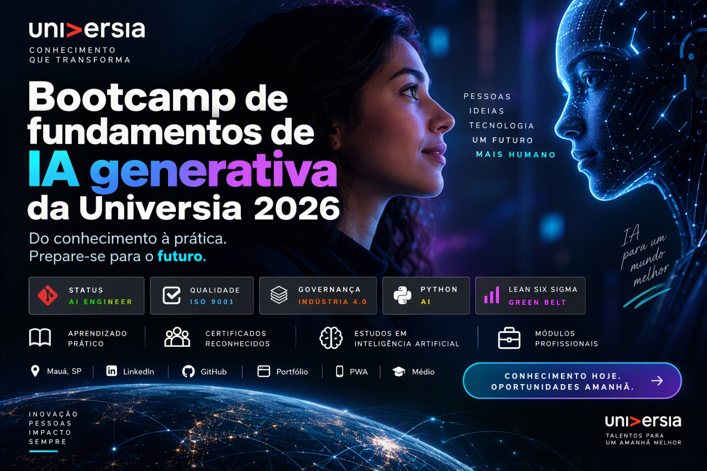

  

  
  
  
  
  

# Universia Generative AI Fundamentals Bootcamp 2026

> **AI Engineer | Especialista em Governança 4.0 e Qualidade | Engenheiro Químico**  
> [Mauá, SP](mailto:ornelas.tozato@gmail.com) | [LinkedIn](https://www.linkedin.com/in/rafaeltozato81) | [GitHub](https://github.com/Rafael-TOZATO) | [Portfólio PWA](https://tozato-dev-hub.vercel.app) | [Medium](https://medium.com/@ornelas.tozato)

## Professional Learning Portfolio

Repository documenting the completion of the Universia Generative AI Fundamentals Bootcamp 2026, including certificates, artificial intelligence studies and professional modules.

## Overview

This portfolio contains 16 completed certificates covering key topics related to Artificial Intelligence, Generative AI, Prompt Engineering, Data Analysis, Project Management, and Digital Transformation.

## Certifications Completed

- Generative Artificial Intelligence Fundamentals
- Responsible AI and Prompt Engineering
- Python for Artificial Intelligence
- Data Analysis and Visualization
- Power BI Fundamentals
- Project Management
- Agile Methodologies
- Leadership and High Performance
- Critical Thinking and Problem Solving
- Sustainability and Digital Transformation
- Additional professional development modules

## Repository Structure

## 🛠️ Governança e Rastreabilidade
- **Status do Repositório:** Alinhado com as diretrizes de portfólio técnico e validação de competências.
- **Trilha Executada:** Consolidação de certificados e projetos práticos em Inteligência Artificial Generativa e transformação digital.

---

## Autor

**Rafael Ornelas Tozato**

Engenharia Química | Garantia da Qualidade | Governança 4.0

---

## 📬 Contatos

- 💼 **LinkedIn:** [rafaeltozato81](https://www.linkedin.com/in/rafaeltozato81)
- 🐙 **GitHub:** [Rafael-TOZATO](https://github.com/Rafael-TOZATO)
- ✍️ **Medium:** [@ornelas.tozato](https://medium.com/@ornelas.tozato)
- 🌐 **Portfólio PWA:** [tozato-dev-hub.vercel.app](https://tozato-dev-hub.vercel.app)
- 🚀 **Aurora BI (Lovable):** [aurora-bi-dio.lovable.app](https://aurora-bi-dio.lovable.app)
